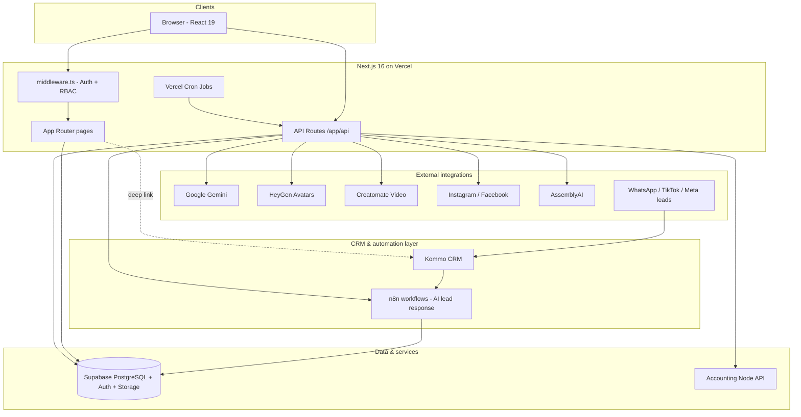
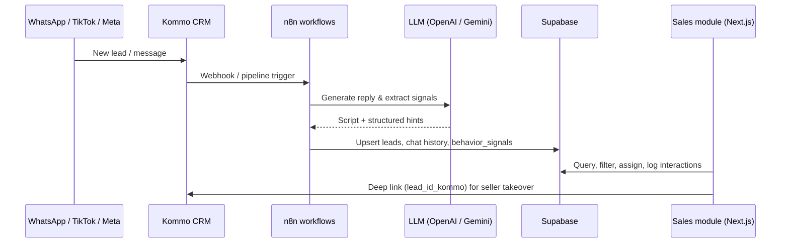

# KSI Nuevos — Dealership Management Platform

**Enterprise web application for [FAG MOTORS / KSI NUEVOS](https://ksinuevos.com)** — a full-stack dealership operating system covering sales, accounting, legal, workshop, insurance, GPS tracking, and AI-powered marketing automation for a new-vehicle dealer in Cuenca, Ecuador.

Built as a production SaaS used daily by internal teams (sellers, accounting, marketing, legal, workshop) and by customers on the public storefront.

---

## Why this project matters

| Area | What the platform delivers |
|------|----------------------------|
| **Sales & CRM** | Lead pipeline synced with **Kommo CRM**, AI-first response via **n8n** (~**3,000 inbound leads/month**), and day-to-day seller workflows in the web app |
| **Operations** | Inventory, leads, contracts, showroom visits, tasks, and financing workflows in one place |
| **Finance** | Treasury, wallet, collections, billing, manual portfolio, and integration with a dedicated accounting API |
| **Marketing** | AI-generated reels, automated news-style clips (“Noticiero”), social publishing to Instagram/Facebook, metrics, and content planning |
| **Compliance & risk** | Legal case management, insurance policies, and role-based access across sensitive modules |
| **Public web** | Vehicle catalog, credit simulator, buy/sell flows, and customer profiles |

For recruiters and reviewers: this is not a tutorial app — it is a **multi-module, role-gated business platform** with real third-party integrations, scheduled jobs, and long-running server pipelines.

---

## Leadership & development

| Role | Name | Links |
|------|------|--------|
| **Lead developer** | Freddy Paguay | [GitHub @FreddyJPC](https://github.com/FreddyJPC) |
| **Developer** | Nathaly Caballero | — |

---

## Tech stack

| Layer | Technologies |
|-------|----------------|
| **Framework** | [Next.js 16](https://nextjs.org) (App Router), [React 19](https://react.dev), TypeScript |
| **Styling** | Tailwind CSS v4, Framer Motion, Lucide icons |
| **Backend / data** | [Supabase](https://supabase.com) (PostgreSQL, Auth, Storage, RPC) |
| **Deployment** | [Vercel](https://vercel.com) (serverless + Cron Jobs) |
| **AI & media** | Google Gemini, HeyGen, Creatomate, AssemblyAI, FFmpeg (WASM) |
| **CRM & automation** | [Kommo](https://www.kommo.com) (lead CRM), [n8n](https://n8n.io) (workflow orchestration, AI chat, webhooks) |
| **Social APIs** | Meta Graph API (Instagram Reels, Facebook Page Reels); WhatsApp / WABA and TikTok sources via Kommo |
| **Documents** | jsPDF, xlsx, browser image compression |
| **UX utilities** | @dnd-kit (kanban), sonner (toasts), date-fns |

**Secondary backend:** a Node.js accounting service (`NEXT_PUBLIC_API_URL`) for cartera and treasury operations separate from Supabase.

---

## High-level architecture



### Design principles

- **Route groups** mirror business domains (`(seller)`, `(accounting)`, `marketing`, `taller`, `legal`, etc.).
- **Middleware + RBAC** enforce permissions from Supabase (`get_my_effective_permissions` RPC) — not only coarse roles.
- **Service layer** (`src/services/`, `src/lib/`) keeps API routes thin; Supabase clients are split (`client` vs `server`) per Next.js best practices.
- **Global auth** via `AuthContext`; feature state in domain hooks under `src/hooks/`.
- **Server pipelines** for heavy work (video/noticiero generation) with `maxDuration` tuned for Vercel and background `after()` where appropriate.

---

## Application modules

### Public & customer (`(home)`, `(auth)`)

- Vehicle discovery, detail pages, credit simulator, buy/sell interest forms
- Supabase Auth: login, register, password recovery
- Customer role routed to public experience only

### Sales (`(seller)`) — CRM hub & high-volume leads

The sales module is the **operational layer** on top of Kommo and n8n: sellers manage what automation cannot close alone, while AI handles first contact at scale.

| Capability | Description |
|------------|-------------|
| **Kommo integration** | Every lead stores `lead_id_kommo` (unique). One-click open in Kommo from lead detail, agenda bot cards, and history. Sources include WhatsApp (WABA), TikTok, Instagram Business, and legacy Kommo channels. |
| **n8n + AI automation** | Workflows on `n8n.ksinuevos.com` orchestrate AI replies, sync data into Supabase (`leads`, `n8n_chat_histories`, `behavior_signals`), and power other domains (e.g. Marketplace scraper via webhooks). |
| **Volume** | ~**3,000 inbound leads per month** are handled with **automated AI responses** for initial qualification and follow-up; the web app is where the team assigns, filters, searches, and converts. |
| **Seller workflows** | Leads list with advanced search (name, phone, Kommo ID, vehicle), temperature/status, trade-in data, interaction history, recovery cadences, showroom visits, contracts, inventory, agenda, and tasks. |
| **Human-in-the-loop** | Bot suggestions surface in agenda/notifications when AI detects visit intent (`day_detected`, `time_reference`, interested vehicles). Sellers approve, reschedule, or take over in Kommo. |

**Data model highlights:** `leads` (CRM mirror), `interactions` (call/Kommo/manual touchpoints), `interested_cars`, `trade_in_cars`, `lead_recovery` (2d/7d/15d/30d sequences), `behavior_signals` (JSON from Kommo/bots for trade-in hints).

### Accounting (`(accounting)`)

- Dashboard, treasury, wallet, collections, billing, sales reports, employee tools
- Manual portfolio (`cartera-manual`) and links to external accounting API
- PDF/Excel exports for operational reporting

### Marketing (`/marketing`)

| Submodule | Description |
|-----------|-------------|
| **Videos** | Multi-step reel creation: clip selection, Gemini scripts, Creatomate renders, music library, publishing queue to Instagram/Facebook |
| **Noticiero (KSI News)** | AI news-style clips: Gemini script → HeyGen presenter → Creatomate template → scheduled social publish |
| **Auto-publish (Noticiero)** | Configurable cron (Mon/Wed/Fri 9:00 AM Ecuador): vehicle rotation, creative topics, avatar rotation, history & manual run |
| **Métricas** | Inventory and script analytics, alerts, reports |
| **Guiones / Publicaciones / Planificador** | Content scripts, publication tracking, calendar planning |
| **Scraper (internal)** | Marketplace price research workflows (`/scraper`) |

### Workshop (`/taller`)

- Reception, jobs, inventory, suppliers, finance, receivables, staff

### Legal (`/legal`)

- Case management for legal team roles

### Insurance (`/seguros`)

- Policies, clients, brokers, renewals, purchases

### GPS (`/rastreadores`)

- Tracker integration module for authorized roles

### Admin

- Permission management (`/admin/permisos`) synced with RBAC catalog

---

## CRM, automation & large-scale data

This platform is built for **real throughput**, not demo datasets.

### Kommo + n8n + Supabase (sales funnel)



- **Kommo** remains the system of record for omnichannel conversations (WhatsApp, social ads, etc.).
- **n8n** runs production automations: AI first response, enrichment, scraper ingestion, and integrations that would be fragile if hard-coded only in the frontend.
- **Supabase** centralizes lead state so the Next.js app can paginate, search, report, and enforce RBAC without hitting Kommo API limits on every page view.
- **~3,000 leads/month** implies strict attention to indexing (`lead_id_kommo`, `assigned_to`, `status`, dates), audit fields (`updated_at`), and UX for high-cardinality lists.

### Other automation touchpoints

| Flow | Stack |
|------|--------|
| Marketplace price scraper | Frontend → Next.js API proxy → n8n webhook → OpenAI extraction → Supabase `scraper_*` tables |
| Marketing video / Noticiero | Vercel cron + Gemini + HeyGen + Meta publish APIs |
| Lead recovery | Scheduled follow-up flags in `lead_recovery` + seller visibility in CRM UI |

---

## Notable technical implementations

### AI video pipeline (Marketing)

1. **Script** — Gemini (`gemini-flash-latest`) with domain prompts (vehicle facts, brand voice “Casi Nuevos”).
2. **Avatar** — HeyGen API with configurable presenters and backgrounds (Supabase Storage bucket `noticiero-fondos`).
3. **Compose** — Creatomate template renders final MP4 with lower-third titles.
4. **Publish** — Queue in Supabase; cron processes due rows; Instagram/Facebook Reels APIs with retry/republish flows.

### Automated Noticiero publishing

- Tables: `noticiero_config` (single-row global settings), `noticiero_history` (audit trail).
- Vercel cron: `0 14 * * 1,3,5` (14:00 UTC = 09:00 Ecuador, UTC−5).
- Secured with `CRON_SECRET`; marketing UI can trigger manual runs with session auth.
- Rotation logic for vehicles (inventory order + no-repeat until cycle reset), avatars, and creative topics (predefined / Gemini / alternating).

### Security & access control

- Supabase session cookies via `@supabase/ssr`
- Role + fine-grained route permissions in middleware
- Service role key only on server API routes that require elevated access
- Marketing/social routes gated with `requireMarketingSession()`

---

## Project structure (simplified)

```
src/
├── app/                    # App Router pages & API routes
│   ├── (home)/             # Public storefront
│   ├── (auth)/             # Login / register
│   ├── (seller)/           # Sales ops
│   ├── (accounting)/       # Finance
│   ├── marketing/          # Marketing UI (videos, noticiero, metrics…)
│   ├── api/                # REST handlers (videos, noticiero, scraper…)
│   ├── taller/             # Workshop
│   └── …
├── components/             # UI by domain + shared primitives (ui/)
├── contexts/               # AuthContext
├── hooks/                  # Feature hooks (accounting, taller, marketing…)
├── lib/                    # Domain logic (noticiero, videos, permissions…)
├── services/               # Supabase data access
├── types/                  # Generated Supabase types
└── middleware.ts           # Auth + RBAC
```

Additional docs: `supabase-schema.md`, `docs/` (RBAC, scraper, insurance, trackers).

---

## Getting started

### Prerequisites

- Node.js 20+
- npm
- Supabase project (URL, anon key, service role key)
- API keys for enabled modules (Gemini, HeyGen, Creatomate, Meta, etc.)

### Install & run

```bash
git clone https://github.com/fagmotorssistemas/KsiNuevos_Frontend.git
cd KsiNuevos_Frontend
npm install
cp .env.example .env   # if available; otherwise configure .env locally
npm run dev
```

Open [http://localhost:3000](http://localhost:3000).

### Build (production check)

```bash
npm run build
npm start
```

Build uses a 4GB Node heap and copies FFmpeg core assets via `scripts/copy-ffmpeg-core.mjs`.

### Lint

```bash
npm run lint
```

### Environment variables (representative)

| Variable | Purpose |
|----------|---------|
| `NEXT_PUBLIC_SUPABASE_URL` | Supabase project URL |
| `NEXT_PUBLIC_SUPABASE_ANON_KEY` | Client-side Supabase |
| `SUPABASE_SERVICE_ROLE_KEY` | Server-only elevated access |
| `GEMINI_API_KEY` | AI scripts & analysis |
| `HEYGEN_API_KEY` | Avatar video generation |
| `CREATOMATE_API_KEY` | Final video renders |
| `INSTAGRAM_*` / `FACEBOOK_*` | Social publishing |
| `CRON_SECRET` | Vercel cron authentication |
| `NEXT_PUBLIC_API_URL` | External accounting backend |

Never commit `.env` files (see `.gitignore`).

---

## Deployment

- **Hosting:** Vercel (Next.js)
- **Database / Auth:** Supabase
- **Cron:** `vercel.json` — video publish queue (every minute) + Noticiero auto-publish (Mon/Wed/Fri)

---

## What to highlight in an interview

- **High-volume CRM**: Kommo + n8n + Supabase design for ~3k leads/month with AI-first response and human takeover in the sales module.
- End-to-end ownership of **AI media pipelines** (prompt engineering, idempotent server jobs, failure recovery).
- **Workflow automation** beyond the UI: n8n as integration bus (CRM, scraper, chat history), not only “a React form”.
- **RBAC at scale** across 10+ business modules with middleware enforcement.
- **Hybrid architecture**: Supabase for most domains + dedicated accounting microservice + external CRM.
- **Production concerns**: cron auth, Ecuador timezone scheduling, social API polling, large upload patterns (signed URLs), paginated lead search at scale.
- **Team delivery** on a real dealership product, not a demo CRUD.

---

## License & usage

Proprietary software developed for **FAG MOTORS / KSI NUEVOS**. All rights reserved by the client organization. This repository is shared for portfolio and technical evaluation purposes unless otherwise agreed in writing.

---

## Contact

- **Freddy Paguay** — [github.com/FreddyJPC](https://github.com/FreddyJPC)
- **Nathaly Caballero** — co-developer

*Built with Next.js, Supabase, and modern AI tooling for automotive retail operations.*
